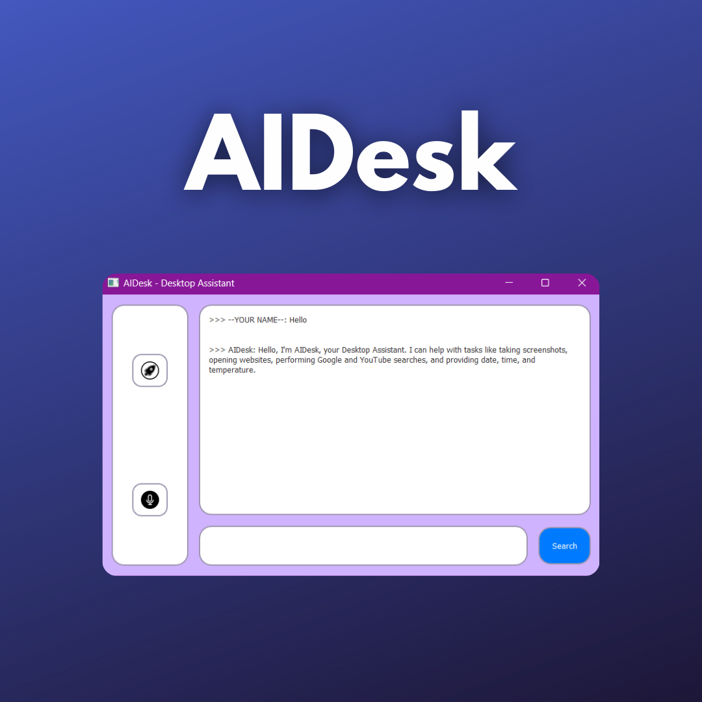

# Desktop Assistant - AIDesk



**AIDesk** is a Python-based desktop assistant designed to make your computer tasks more convenient and efficient. It can perform various tasks through voice commands and text interactions.

## Table of Contents

- [Introduction](#introduction)
- [Features](#features)
- [Prerequisites](#prerequisites)
- [Installation](#installation)
- [Customization](#customization)
- [Usage](#usage)
- [Contributing](#contributing)

## Introduction

AIDesk is a versatile desktop assistant that leverages various libraries and technologies to provide a range of functionalities, including:

- Voice-controlled commands
- Web searches on Google and YouTube
- Opening websites
- Taking screenshots
- Providing date and time information
- Displaying temperature information for cities
- Generating AI-based responses using OpenAI's GPT-3.5 Turbo model

The assistant provides a graphical user interface (GUI) for users to interact with. The GUI offers a user-friendly experience.

## Features

- Voice recognition and interaction
- Web searches on Google and YouTube
- Website opening
- Screenshot capture
- Date and time information
- Weather information for cities
- AI-based responses using GPT-3.5 Turbo
- User-friendly GUI

## Prerequisites

Before you can use AIDesk, ensure you have the following prerequisites installed on your system:

- Python 3.6 or higher
- Required Python libraries (specified in the `requirements.txt` file)
- PyQt5 for the graphical user interface (install using `pip install PyQt5`)
- OpenAI API key for AI-based responses (replace the key in the code)
- WeatherAPI API key for weather information (replace the key in the code)

## Installation

1. Clone this repository to your local machine:

    ```bash
    git clone https://github.com/Desai-Vedant/AI-Desktop-Assistant.git
    ```

2. Navigate to the project directory:

    ```bash
    cd AI-Desktop-Assistant
    ```

3. Install the required Python libraries from the `requirements.txt` file:

    ```bash
    pip install -r requirements.txt
    ```

## Customization

1. **OpenAI API Key**: Replace the OpenAI API key in the code with your own API key. Obtain your API key by signing up for OpenAI's GPT-3.5 Turbo model.

    - Locate the following line in `functions.py`:

        ```python
        openai.api_key = '--YOUR OPENAI API KEY--'
        ```

    - Replace `'--YOUR OPENAI API KEY--'` with your API key.

2. **Owner Name**: Customize the owner's name in the code to your preferred name. This is the name the assistant will use when interacting with you.

    - Locate the following line in `functions.py`:

        ```python
        self.owner_name = "--YOUR NAME--"
        ```

    - Replace `"--YOUR NAME--"` with your preferred name.

3. **Assistant Name**: Customize the assistant's name in the code to your preferred name. This is the name by which you'll address the assistant.

    - Locate the following line in `functions.py`:

        ```python
        self.assistant_name = "AIDesk"
        ```

    - Replace `"AIDesk"` with your preferred assistant name.

4. **WeatherAPI API Key**: If you plan to use the weather information feature, replace the WeatherAPI API key in the code with your own API key.

    - Locate the following line in `functions.py`:

        ```python
        self.weather_api_key = "--YOUR WEATHER API KEY--"
        ```

    - Replace `'--YOUR WEATHER API KEY--'` with your own WeatherAPI API key.

## Usage

- Run the assistant with the following command:

    ```bash
    python main.py
    ```

- The GUI interface will open, allowing you to interact with AIDesk through buttons and voice commands.

## Contributing

Contributions to AIDesk are welcome! If you have ideas for improvements or new features, please submit a pull request or open an issue on the GitHub repository.

---

Enjoy the convenience of having your own desktop assistant! If you have any questions or encounter issues, feel free to reach out to the project maintainers.
